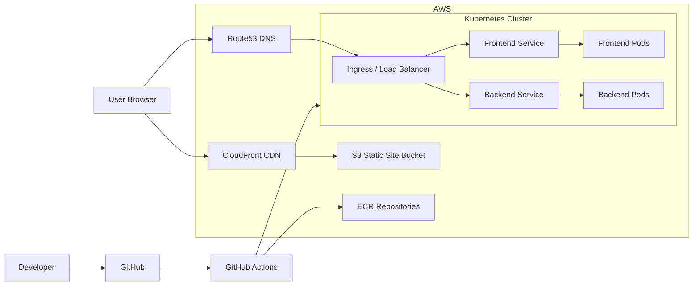
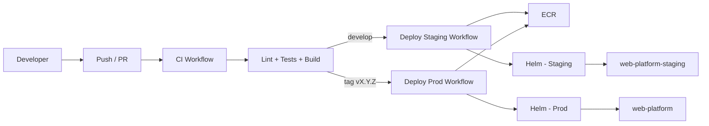
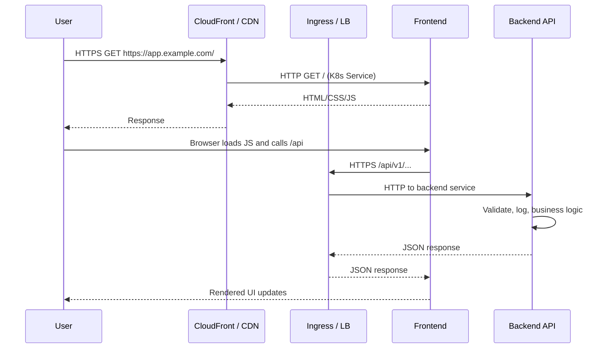

# Architecture Diagrams

## 1. Cloud Architecture (AWS + K8s)

```mermaid
flowchart LR
  user[User Browser] --> cdn[CloudFront CDN]
  cdn --> s3[S3 Static Site Bucket]

  user --> dns[Route53 DNS]
  dns --> ingress[Ingress / Load Balancer]

  ingress --> fe[Frontend Service]
  ingress --> be[Backend Service]

  fe --> fePods[Frontend Pods]
  be --> bePods[Backend Pods]

  subgraph AWS
    s3
    cdn
    dns
    ecr[ECR Repositories]
    subgraph K8sCluster[Kubernetes Cluster]
      ingress
      fe
      be
      fePods
      bePods
    end
  end

  dev[Developer] --> gh[GitHub]
  gh --> gha[GitHub Actions]
  gha --> ecr
  gha --> K8sCluster
```

## 2. CI/CD Pipeline

```mermaid
flowchart LR
  dev[Developer] --> pr[Push / PR]
  pr --> ci[CI Workflow]
  ci --> tests[Lint + Tests + Build]

  tests -->|develop| stagingDeploy[Deploy Staging Workflow]
  tests -->|tag vX.Y.Z| prodDeploy[Deploy Prod Workflow]

  stagingDeploy --> ecr[ECR]
  prodDeploy --> ecr

  stagingDeploy --> helmStg[Helm - Staging]
  prodDeploy --> helmProd[Helm - Prod]

  helmStg --> stgNs[web-platform-staging]
  helmProd --> prodNs[web-platform]
```

## 3. Application Request Flow

```mermaid
sequenceDiagram
  participant U as User
  participant CF as CloudFront / CDN
  participant I as Ingress / LB
  participant FE as Frontend
  participant BE as Backend API

  U->>CF: HTTPS GET https://app.example.com/
  CF->>FE: HTTP GET / (K8s Service)
  FE-->>CF: HTML/CSS/JS
  CF-->>U: Response

  U->>FE: Browser loads JS and calls /api
  FE->>I: HTTPS /api/v1/...
  I->>BE: HTTP to backend service
  BE->>BE: Validate, log, business logic
  BE-->>I: JSON response
  I-->>FE: JSON response
  FE-->>U: Rendered UI updates
```

